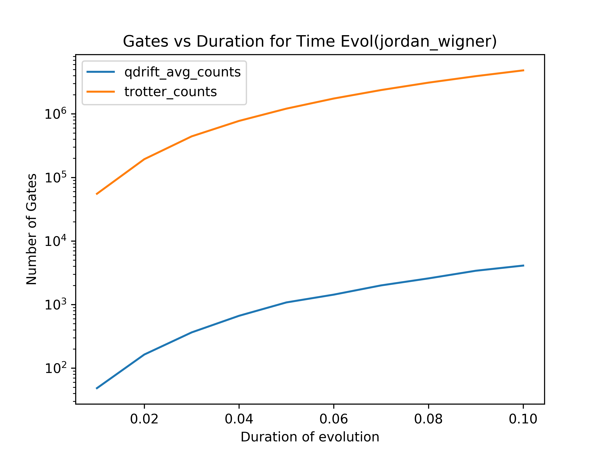

# qiskit-qdrift-quid19
Prototype implementation of qdrift algorithm for quantum chemistry simulation
from [https://arxiv.org/abs/1811.08017](https://arxiv.org/abs/1811.08017).

In order to solve the important electronic structure problem, it is important to be
able to calculate the energy of a given moleucle. One of the ways to do this is
by preparing a state, time evolving under the Hamiltonian for a sequence of
times, and measuring the phases. From this, we can infer the energy.

The time evolution is a difficult step especialy in quantum chemistry where our
Hamiltonian may have O(n^4) terms.

The standard Trotter approximations U(t) ~= V(t) = \prod_j exp(-i(t)h_j H_j) for
t small.

The algorithm we have implemented here approaches the problem of decomposing
U(t) in a slightly different way.

We set a standard rotation angle for all the terms in the Hamiltonian, and then
generate a sequence of rotations as detailed in the paper.

This method was reported to be able to reduce the gates required to simulate the
time evolution by up to 1000x.
 
We have implemented this in Qiskit by creating a modified version of the Iterative Phase
Estimation algorithm which measures the energy of the ground state with
precision increasing with iterations (https://arxiv.org/pdf/quant-ph/0610214.pdf).

# Usage of our code

## Estimating gate counts
To get the gate counts for H2 and LiH, run the files `H2_gate_counts.py` and
`LiH_gate_counts.py`. These can be edited to find counts for other molecules. 

## Estimating energies

To generate the plots of energy for H2 and compare against the reference from
the exacteigensolve method, use the `run_iqpe.py` script. This script accepts the 
following usage options

```
usage: run_iqpe.py [-h] [-p PROCESSES] [-r] [-i] [-s STEPS] [-f FIRST_ATOM]
                   [-e ERROR] [-v]

optional arguments:
  -h, --help            show this help message and exit
  -p PROCESSES, --processes PROCESSES
                        Number of processes to use (default=1)
  -r, --no-ref          Do not calculate reference values using exact
                        eigensolver.
  -i, --include-standard-iqpe
                        Include the standard IQPE method.
  -s STEPS, --steps STEPS
                        Number of distance steps to use between 0.5 and 1.0
                        (default=10).
  -f FIRST_ATOM, --first_atom FIRST_ATOM
                        The first atom (default=H).
  -e ERROR, --error ERROR
                        The error to use for qdrift IQPE (default=0.1).
  -v, --verbose
```

# Results

 

We also saw a massive reduction in the case of LiH but less so for H2 

 

We have implemented Iterative Phase Estimation to measure the energy.

# Possible extensions of this project:

Do some more work on how our code handles the results from the randomized rotations
